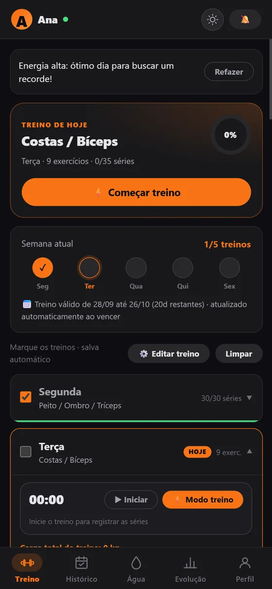
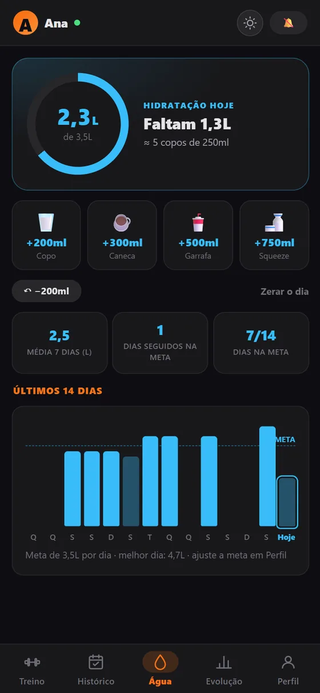

# EAFIT — Treino

PWA (Progressive Web App) para acompanhamento de treino, hidratação e evolução física, com sincronização em nuvem e uso offline.

🔗 **App em produção:** https://eafit.com.br/app/
📣 **Site:** https://eafit.com.br/ (home, Recursos, Para personais, Biblioteca de exercícios, Ajuda e Sobre)

 

## Funcionalidades

- **Treino semanal** — plano de treino dividido por dia da semana, com séries, repetições, técnica e tempo de descanso por exercício. Marque séries concluídas e registre a carga usada em cada uma.
- **Modo treino ao vivo** — tela cheia com um exercício por vez: séries com campos grandes, descanso embutido (com +15s/pular e alarme), progresso do treino, tela sempre acesa (Wake Lock) e navegação entre exercícios. Abre pelo card "Treino de hoje" ou pelo botão ⚡ de cada dia.
- **Histórico** — calendário mensal dos treinos (concluídos e incompletos), resumo do mês (treinos, tempo, séries, volume) e o detalhe de cada sessão com a comparação de cada exercício contra a última vez que ele foi feito.
- **Demonstração de execução** — botão "▶ Ver execução" na lista de exercícios e no modo ao vivo. 40 exercícios têm vídeo curto real (≈7s, sem áudio, com opção de câmera lenta) do [wger](https://wger.de) (CC BY-SA 4.0, autor Goulart) e do Wikimedia Commons (Burpee e Remada com Barra T, créditos em `exerciseVideos.js`), em `app-react/public/videos/` (mapeamento em `app-react/src/data/exerciseVideos.js`); os demais alternam dois quadros do movimento. Cobre 200 nomes de exercício; os sem equivalente seguro não mostram o botão. Imagens do [Free Exercise DB](https://github.com/yuhonas/free-exercise-db) (domínio público), em `app-react/public/exercicios/`, fora do precache e guardadas em cache após a primeira visualização. Mapeamento em `app-react/src/data/exerciseMedia.js`. O admin pode enviar GIF, imagem ou vídeo próprio (até 15MB) por exercício em **Painel admin → Demonstrações**; a mídia própria substitui a padrão no app, e o filtro "Sem vídeo" lista o que ainda falta gravar (tabela `exercise_media` + bucket público `exercise-media`).
- **Hidratação** — meta diária de água calculada a partir do peso, anel de progresso do dia, adições rápidas (copo, caneca, garrafa, squeeze) com desfazer, média dos últimos 7 dias, sequência de dias na meta, barras dos últimos 14 dias e lembretes.
- **Evolução** — resumo no topo (treinos em 30 dias, sequência, recordes, conquistas) e abas Treinos, Recordes e Corpo, com:
  - avatar corporal indicando os grupos musculares trabalhados no dia
  - gráfico de volume total por treino
  - heatmap dos últimos 35 dias
  - treinos concluídos por semana
  - evolução de carga por exercício
  - recordes pessoais (PRs)
- **Perfil** — dados corporais (peso, altura), cálculo de IMC, meta principal, estatísticas de frequência e sequência de treinos.
- **Conta e sincronização** — login/cadastro por e-mail, dados salvos na nuvem e sincronizados entre dispositivos.
- **Offline-first** — funciona como PWA instalável, com cache local e atualização automática de versão.
- **Tema claro/escuro** com detecção automática da preferência do sistema.

## Stack

- [React](https://react.dev/) + [Vite](https://vite.dev/)
- Backend como serviço para autenticação e persistência de dados (configurado via variáveis de ambiente, não versionadas)
- `vite-plugin-pwa` para o service worker e manifest do PWA
- Deploy automático no GitHub Pages via GitHub Actions

## Estrutura do repositório

```
.
├── app-react/          # código-fonte do app (React + Vite)
│   ├── public/
│   │   └── landing/      # site estático de divulgação (raiz do domínio)
│   ├── scripts/         # build-site.mjs: gera a página da biblioteca (em números) e o sitemap
│   ├── src/
│   │   ├── components/  # componentes de UI reutilizáveis
│   │   ├── context/      # estado global (auth, tema, toast, treino)
│   │   ├── data/         # dados estáticos do plano de treino
│   │   ├── lib/           # cliente de dados e utilitários
│   │   ├── pages/        # telas do app (Treino, Histórico, Água, Evolução, Perfil)
│   │   └── styles/       # CSS por área, importado em ordem por index.css
│   └── vite.config.js
├── app-admin/          # backoffice (React + Vite), publicado em /admin
├── site-root/          # arquivos da raiz do domínio (404, robots.txt)
├── supabase/
│   ├── functions/       # Edge Functions (Deno); _shared/ tem código + testes
│   └── migrations/      # schema, RLS e RPCs
└── .github/workflows/   # deploy.yml (Pages) e supabase.yml (testes/deploy do backend)
```

## Convenções

- **Nomenclatura**: termos de domínio (treino, carga, dia, foco, água) ficam em
  português; infraestrutura e nomes de código genéricos (`WorkoutContext`,
  `fetchDashboardData`, `useReminders`) ficam em inglês. A mistura é
  intencional, não inconsistência — ao criar algo novo, siga o que já existe
  ao redor do arquivo que você está mexendo.
- **Context**: cada `context/XContext.jsx` exporta só o `XProvider`; o objeto
  de context e o hook (`useX`) ficam em `context/useX.js`. Arquivo `.jsx` que
  exporta componente e não-componente juntos perde o Fast Refresh (o lint
  avisa).
- **Idiomas (pt/en)**: a interface usa o próprio texto em português como chave de tradução: `t('Iniciar treino')` (de `lib/i18n.js`). O inglês fica em `app-react/src/i18n/en/`; texto sem tradução cai no português. Ao criar texto novo na interface, envolva em `t()` e adicione a entrada em `i18n/en/` — o teste `lib/i18n.test.js` falha se faltar. Datas e números usam `locale`. O idioma é escolhido em Perfil → Idioma (ou na tela de acesso) e recarrega o app. **Exercícios e planos**: o dado fica em português (o nome é a chave do histórico e dos recordes); só a exibição passa por `tEx`/`tTec`/`tFoco`/`tReps` (`lib/i18n.js`), com o dicionário em `i18n/en/exercises.js` — exercício criado pelo usuário ou pelo personal aparece como foi digitado. `data/exerciseI18n.test.js` falha se um nome/técnica/foco dos planos prontos ou da biblioteca (migrations) ficar sem tradução. **Notificações do servidor**: o app grava o idioma em `user_metadata.lang` (hook `useSyncLang`) e as Edge Functions (`send-reminders`, `send-engagement`, alertas e lembretes de aula do personal) mandam push em pt ou en (`_shared/lang.ts`, `reminderTexts.ts`). As regras de `engagement_rules` têm `title_en`/`body_en` (o painel edita os dois idiomas em Automáticas → "Versão em inglês"; sem título e mensagem em inglês, cai no português), e `_shared/exerciseI18n.ts` é cópia gerada de `exercises.js` (teste de divergência). Avisos do admin e recados do personal vão como foram escritos. **Site e termos**: seletor PT/EN no site (`landing/i18n-en.js`, mesmo `app_lang` do app; a página da biblioteca soma um dicionário gerado no build) e nos Termos/Privacidade (versão em inglês de cortesia, a em português prevalece e continua precisando de revisão jurídica); texto da landing editado no admin que ainda não tem tradução fica em português. **Fora do escopo**: o painel admin (backoffice interno).
- **Duplicação entre app-react e as Edge Functions (Deno)**: como os dois
  ambientes não compartilham build, algumas lógicas (geração de plano por
  IMC/nível, exclusão de dados do usuário) são portadas manualmente em vez de
  importadas de um pacote comum. Cada arquivo com esse tipo de duplicação
  documenta no topo qual é o "original" e onde fica a cópia — ver
  `app-react/src/data/workoutAdjustments.js` e
  `supabase/functions/_shared/workoutAdjustments.ts` como exemplo (o mesmo vale
  pra `exerciseLibrary.js` ↔ `_shared/exerciseLibrary.ts`). Ao mudar um lado,
  replique no outro — os testes dos dois lados rodam no CI.

- **Site (`app-react/public/landing/`)**: HTML estático, sem framework. Cada
  página é uma pasta com `index.html` (`recursos/`, `personal/`, `ajuda/`,
  `sobre/`) e todas usam `assets/site.css` e `assets/site.js`. Os blocos
  `site-head`, `site-header` e `site-footer` são repetidos em cada página e
  precisam ser idênticos (o teste `scripts/build-site.test.js` falha se
  divergirem). Links e assets usam caminho absoluto (`/recursos/`,
  `/assets/site.css`), porque o deploy publica a pasta na raiz do domínio.
  As seções com `data-section` continuam editáveis no painel admin; a mesma
  seção pode aparecer resumida na home (`data-limit`) e completa na página
  interna. A **biblioteca de exercícios** (`/exercicios/`) mostra só números:
  quantos exercícios há por grupo muscular, equipamento, tipo e nível, sem listar nomes nem demonstrações (isso fica dentro do app). Ela e o `sitemap.xml` não são versionados: `npm run site` (ou
  `npm run build`) gera os dois a partir do seed de `exercise_library` nas
  migrations e das demonstrações de `exerciseMedia.js`/`exerciseVideos.js`.
  Página nova escrita à mão: crie a pasta, copie os três blocos da home,
  adicione o inglês em `landing/i18n-en.js` e, se for o caso, o link no menu.

## Rodando localmente

```bash
cd app-react
npm install
```

Crie um arquivo `.env` dentro de `app-react/` (não é versionado) com as credenciais do seu próprio projeto de backend — use `app-react/.env.example` como modelo:

```
VITE_SUPABASE_URL=<url do seu projeto>
VITE_SUPABASE_ANON_KEY=<chave publica/anon do seu projeto>
VITE_VAPID_PUBLIC_KEY=<chave publica VAPID, gerada com `npx web-push generate-vapid-keys`>
```

`VITE_VAPID_PUBLIC_KEY` é usada para inscrever o navegador em notificações push (funcionam com o app fechado). Sem ela, o app funciona normalmente, só a inscrição de push falha com "Push não configurado". A chave privada correspondente fica só no backend, como secret `VAPID_PRIVATE_KEY` das Edge Functions `send-reminders` e `send-push` (nunca no frontend).

Edge Functions de push (implantadas pelo workflow `supabase.yml`, ver [Deploy](#deploy)):
- `send-reminders` e `send-scheduled-broadcast` — chamadas só pelo cron (`pg_cron`, a cada minuto); **Verify JWT desativado**, pois não há usuário logado numa chamada interna do cron. Em vez de JWT, só aceitam requisição com o header `x-cron-secret` (valor guardado no Supabase Vault e no secret `CRON_SECRET` das funções — ver `supabase/migrations/20260925010000_cron_secret.sql`). `send-reminders` cobre refeição/água (horário fixo) e as notificações inteligentes: sequência em risco, inatividade, resumo semanal e lembrete de atualizar o peso (segunda de manhã).
- `send-push` — chamada pelo próprio app logo após um evento (novo recorde, conquista desbloqueada); **Verify JWT ativado**, já que o usuário só pode mandar push pra si mesmo (o `user_id` vem do token da sessão, nunca do corpo da requisição).

Depois:

```bash
npm run dev      # ambiente de desenvolvimento
npm run build    # build de produção em app-react/dist
```

## Deploy

O deploy é automático: qualquer push em `main` que altere arquivos dentro de `app-react/` dispara o workflow `.github/workflows/deploy.yml`, que builda o projeto e publica no GitHub Pages, no domínio próprio `eafit.com.br`: o site na raiz, o app em `/app/` e o painel em `/admin/`.

Backend (Supabase): o workflow `.github/workflows/supabase.yml` roda os testes e a checagem de tipos das Edge Functions em todo push/PR que mexe em `supabase/`. Aplicar migrations e implantar funções em produção é **manual**, em Actions → Supabase → Run workflow (marque "Aplicar migrations" e/ou "Implantar todas as Edge Functions"; migrations rodam antes das funções). Precisa dos secrets `SUPABASE_ACCESS_TOKEN`, `SUPABASE_PROJECT_ID` e `SUPABASE_DB_PASSWORD` no repositório. Localmente, `supabase db push` (com o CLI linkado) continua funcionando.

## Antes de abrir pra outras pessoas

O app já suporta múltiplas contas (cadastro por e-mail, RLS isolando os dados de cada
usuário) e tem Termos de Uso + Política de Privacidade em `app-react/public/legal/`
(com checkbox obrigatório no cadastro). Antes de divulgar amplamente, faltam alguns
passos manuais:

- **Revisão jurídica dos textos legais**: `legal/termos.html` e `legal/privacidade.html`
  já têm e-mail de contato e foro preenchidos; falta só `[nome/razão social, CNPJ ou
  CPF]` — preencher e pedir revisão antes de tratar como documento válido.
- **Leaked password protection**: ativar em Authentication → Policies no dashboard do
  Supabase (não dá pra fazer via CLI sem risco de sobrescrever outras configs de Auth).
- **E-mail transacional**: o SMTP embutido do Supabase tem limite baixo de e-mails/hora.
  O envio passa a ser pela conta Gmail do projeto (`contato.eafit@gmail.com`, limite de
  ~500 destinatários/dia), o que exige três passos manuais:
  1. Na conta Google: ligar a verificação em duas etapas e criar uma **senha de app**
     (Segurança → Senhas de app).
  2. No dashboard do Supabase, Authentication → SMTP Settings: host `smtp.gmail.com`,
     porta `465`, usuário e remetente = o endereço do Gmail, senha = a senha de app,
     nome do remetente `EAFIT`. Depois, em Authentication → Email Templates, colar os
     arquivos de `supabase/templates/` (`recovery.html` em Reset Password,
     `confirmation.html` em Confirm signup, `email_change.html` em Change Email
     Address; e, na parte de avisos de segurança, `password_changed_notification.html`
     e `email_changed_notification.html`, ligando cada aviso). O botão deles aponta pro próprio app (`?token_hash=...`, lido por
     `lib/emailLink.js`), então só cole uma versão nova depois que o app correspondente
     estiver publicado. Eles escolhem português ou inglês pelo `lang` da conta; o
     campo Subject de cada um está em `supabase/templates/subjects.txt`. Os arquivos
     são gerados do layout compartilhado (`_shared/emailLayout.ts`): para mudar texto
     ou visual, edite `supabase/templates/build.ts` e rode
     `deno run --allow-write=supabase/templates supabase/templates/build.ts`.
  3. Nos secrets das Edge Functions: `GMAIL_USER` e `GMAIL_APP_PASSWORD`, usados por
     `supabase/functions/_shared/email.ts` (sem eles, as funções só não enviam e-mail).
     Hoje enviam e-mail: `send-welcome` (boas-vindas, chamada pelo app no cadastro),
     `delete-account` (confirmação de conta excluída), `send-weekly-emails` (resumo da
     semana ou convite pra voltar, toda segunda pelo cron) e `admin-broadcast` (comunicado
     com "enviar também por e-mail" e resposta a feedback). Resumo, convite e comunicado
     respeitam o descadastro (`user_metadata.notifyEmail`, chave no Perfil e link no
     rodapé, atendido por `email-unsubscribe`) e o teto de 300 destinatários por envio.
- **Custo/escala**: checar os limites do plano atual do Supabase (linhas de banco,
  storage de fotos, invocações de Edge Function) antes de divulgar amplamente.
